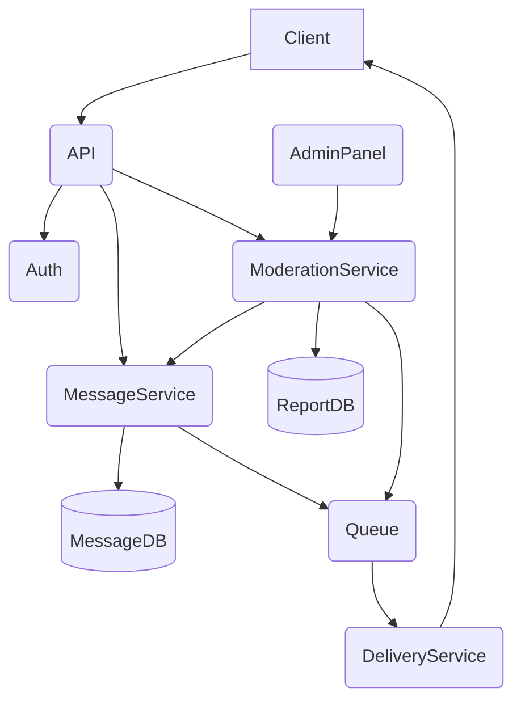

```mermaid
graph TD
    Client[Client] --> API(API)
    API --> Auth(Auth)
    API --> MessageService(MessageService)

    MessageService --> DB[(MessageDB)]
    MessageService --> Queue(Queue)

    Queue --> DeliveryService(DeliveryService)
    DeliveryService --> Client

    API --> ModerationService(ModerationService)
    ModerationService --> ReportDB[(ReportDB)]

    ModerationService --> Queue
    AdminPanel(AdminPanel) --> ModerationService
    ModerationService --> MessageService
```
