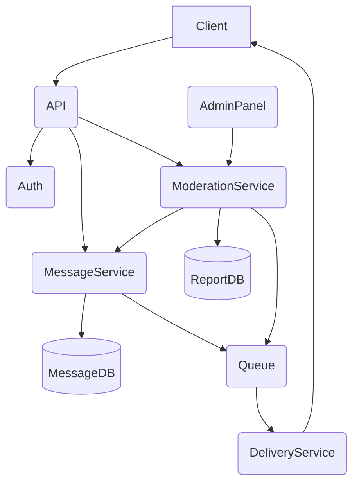
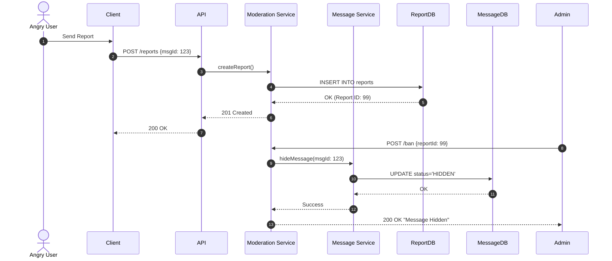
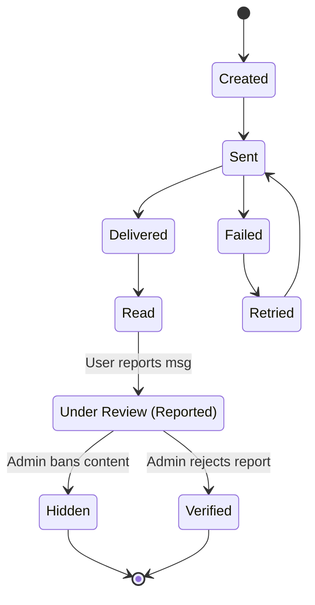

## Part 1 — Component Diagram

```mermaid
graph TD
    Client[Client] --> API(API)
    API --> Auth(Auth)
    API --> MessageService(MessageService)

    MessageService --> DB[(MessageDB)]
    MessageService --> Queue(Queue)

    Queue --> DeliveryService(DeliveryService)
    DeliveryService --> Client

    API --> ModerationService(ModerationService)
    ModerationService --> ReportDB[(ReportDB)]

    ModerationService --> Queue
    AdminPanel(AdminPanel) --> ModerationService
    ModerationService --> MessageService
```

---

## Part 2 — Sequence Diagram

```mermaid
sequenceDiagram
  autonumber

  actor User as Angry User
  participant Client
  participant API
  participant Mds as Moderation Service
  participant Msg as Message Service
  participant ReportDB
  participant MessageDB
  participant Admin

  User->> Client: Send Report
  Client->>API: POST /reports {msgId: 123}
  API->>Mds: createReport()
  Mds->>ReportDB: INSERT INTO reports
  ReportDB-->>Mds: OK (Report ID: 99)
  Mds-->>API: 201 Created
  API-->>Client: 200 OK
  Admin->>Mds: POST /ban {reportId: 99}
  Mds->>Msg: hideMessage(msgId: 123)
  Msg->>MessageDB: UPDATE status='HIDDEN'
  MessageDB-->>Msg: OK
  Msg-->>Mds: Success
  Mds-->>Admin: 200 OK "Message Hidden"
```

---

## Part 3 — State Diagram

### Object

`message`

```mermaid
stateDiagram-v2
  [*] --> Created
  Created --> Sent
  Sent --> Delivered
  Delivered --> Read
  state "Under Review (Reported)" as Reported

  Read --> Reported : User reports msg
  Sent --> Failed
  Failed --> Retried
  Retried --> Sent

  Reported --> Hidden : Admin bans content
  Reported --> Verified : Admin rejects report

  Hidden --> [*]
  Verified --> [*]
```
